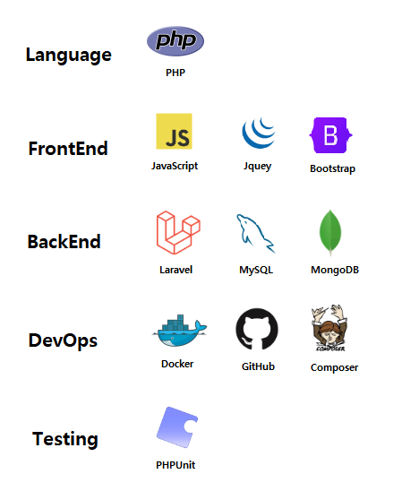

# Laravel 8 CMS

Laravel 8 기반의 모듈형 CMS 시스템으로, Google/Naver/Kakao 소셜 로그인과 자체 회원가입을 모두 지원합니다. 관리자 대시보드와 확장 가능한 컨텐츠 관리 기능을 제공하며, 자동화된 테스트를 통해 안정성을 보장합니다


## 🚀 프로젝트 개요

모듈화된 CMS 시스템을 구현합니다. 주요 특징으로는:
- Laravel 8 기반의 안정적인 백엔드 구현
- Docker를 통한 컨테이너화된 개발 환경
- 모듈화된 Social Login 지원과 통합 회원가입 지원 (Google, Naver, Kakao 연동 및 자체 회원가입 )
- 자동화된 테스트 시스템 (Unit & Feature 테스트)
- 관리자 전용 관리 시스템


## 🛠️ 기술 스택




## 🏛️ 시스템 아키텍처


## 📸 스크린샷

### 로그인


### 관리자 대시보드


### 게시판 관리


### 게시판 설정 관리


## 🏗️ 프로젝트 구조
```text
laravel8-cms/
├── app/                         # Laravel 애플리케이션 코드
│   ├── Http/                    # HTTP 관련 코드 (Controllers, Middleware)
│   ├── Models/                  # Eloquent 모델
│   ├── Repositories/            # 데이터 접근 레이어
│   └── Services/                # 비즈니스 로직 서비스
├── public/                      # Public assets
│   ├── css/                     # CSS 파일
│   ├── js/                      # JavaScript 파일
│   └── images/                  # 이미지 파일
├── resources/                   # 리소스 파일
│   ├── views/                   # Blade 템플릿
│   ├── lang/                    # 언어 파일
│   └── assets/                  # 개발용 자산
├── routes/                      # 라우트 정의
│   ├── web.php                  # 웹 라우트
│   └── api.php                  # API 라우트
├── storage/                     # 파일 저장소
│   ├── app/                     # 애플리케이션 저장소
│   ├── framework/               # 프레임워크 저장소
│   └── logs/                    # 로그 파일
├── tests/                       # 테스트 코드
│   ├── Feature/                 # 기능 테스트
│   └── Unit/                    # 단위 테스트
└── .docker/                     # Docker 구성
```


## ✨ 기능 목록

- [x] 사용자 인증 (회원가입/로그인)
- [x] Social Login (Google, Naver, Kakao)
- [x] 컨텐츠 관리 시스템
- [x] 관리자 대시보드
- [ ] API 문서화
